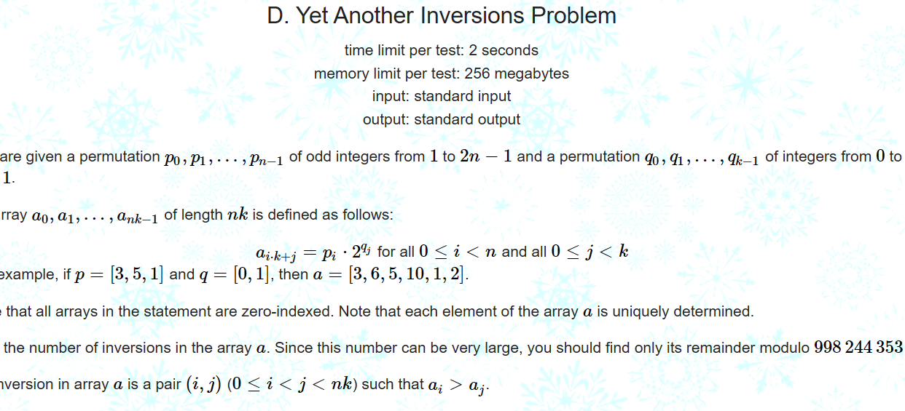

# fenwick

[1917/problem/D](https://codeforces.com/contest/1917/problem/D)

将问题分成三类：

独自区间里，相关区间之间绝对大于1<<B,和相关区间小于B

+ 对于第一个区间，其中的pi一样，不一样的只有q,那其实就是对排列qi求逆序对，树状数组维护即可
+ 找到一个绝对的参数，是的当两者的2的幂的差大于这个参数，无论取任何数都无法改变。这里注意是2n，不是n,md被坑了半天。 2n = 4e5,那么取 B = 19，  1<<19 > 4e5.找到参数之后对于任意两个区间，选（n,2）,之后剩下的合法随便选，由于是排列，那么直接无脑算就行。不需要考虑重复。
+ 对于第三个部分，差小于1<<B,那么我们维护B+1个树状数组，前B个记录之前的操作+delta,最后一个记录当前的操作+delta.对于前面操作的更新，需要注意每一个更新要乘上参数para,因为差为x的区间队显然不只一个。

时间复杂度：
$$
klog(k)+Bnlog(n)
$$

# segtree

## 主席树

[6.选糖果【算法赛】 - 蓝桥云课 (lanqiao.cn)](https://www.lanqiao.cn/problems/12115/learning/?contest_id=161)

# DSU

large to small : 

[ROUND 919 DIV2 F2](https://codeforces.com/contest/1920/problem/F2)

# shortest path

2-d coord convert to graph

[EDU138 DIV2 E](https://codeforces.com/contest/1749/problem/E)
